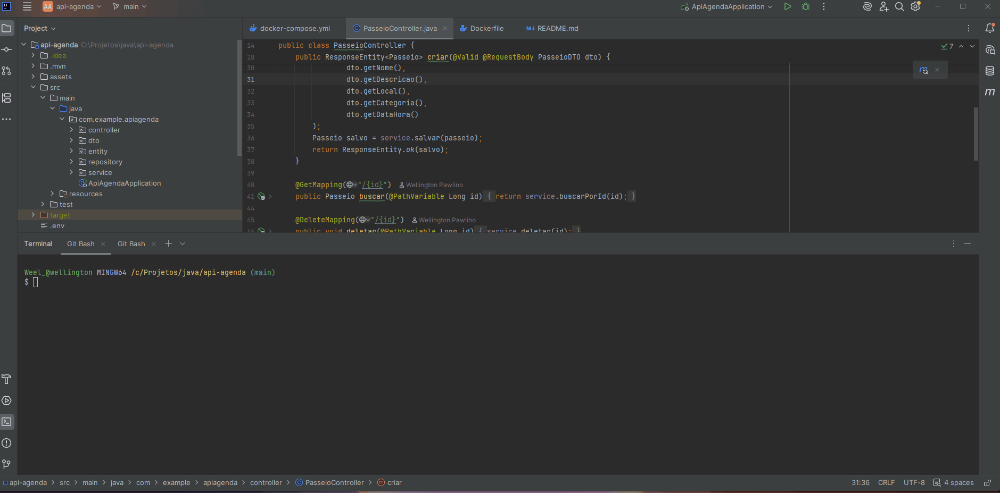

# 📅 **Agenda API**

**Tecnologias:** `Java | Spring Boot | Docker | H2`


[](https://git.io/typing-svg)

---

## 🎯 **Descrição do Projeto**
API REST para gerenciamento de passeios, construída com **Spring Boot**, persistência em **H2** e containerização via **Docker**.  
Inclui operações **CRUD completas**, validações e documentação interativa com **Swagger**.

---

## 🎥 **Demonstração**


---

## 📖 **Documentação da API**
Este projeto utiliza **SpringDoc OpenAPI** para gerar documentação interativa dos endpoints.

Após subir a aplicação com Docker ou rodar localmente, acesse:  
👉 **[http://localhost:9090/swagger-ui.html](http://localhost:9090/swagger-ui.html)**

### ✅ Como habilitar Swagger
Adicione a dependência no `pom.xml`:

```xml
<dependency>
    <groupId>org.springdoc</groupId>
    <artifactId>springdoc-openapi-starter-webmvc-ui</artifactId>
    <version>2.3.0</version>
</dependency>


````
## Arquitetura
```
📦 api-agenda/
├── 📁 src/main/java/com/example/apiagenda/
│   ├── controller/      # Endpoints REST
│   ├── dto/             # Objetos de transferência
│   ├── entity/          # Entidades JPA
│   ├── repository/      # Interfaces JPA
│   └── service/         # Regras de negócio
├── 📁 src/main/resources/
│   └── application.properties
├── 📄 Dockerfile         # Imagem da aplicação
├── 📄 docker-compose.yml # Orquestração com MySQL
└── 📄 README.md          # Documentação do projeto
````

## 🌐 Endpoints da API

| Método  | Endpoint            | Descrição                |
|---------|----------------------|--------------------------|
| **GET**     | `/passeios`         | Lista todos os passeios |
| **GET**     | `/passeios/{id}`    | Busca passeio por ID    |
| **POST**    | `/passeios`         | Cria um novo passeio    |
| **PUT**     | `/passeios/{id}`    | Atualiza passeio        |
| **DELETE**  | `/passeios/{id}`    | Remove passeio          |
